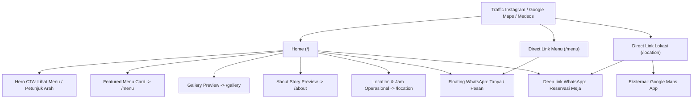

# SITEMAP.md
## Arsitektur Informasi & Navigasi — CafeSite

Dokumen ini memetakan seluruh rute halaman, hierarki navigasi, prioritas crawling SEO, serta section yang di-render pada setiap halaman untuk project **CafeSite**.

---

## 1. Ikhtisar Rute & Navigasi

Sesuai dengan `RPD.md` §5, website CafeSite terdiri dari **5 halaman rute statis** dan **1 section konversi (Contact/Reservation)** yang hadir sebagai komponen lintas halaman dan section dedicated di Home & Location.

| Urutan Nav | Halaman | URL | Fungsi Utama | Prioritas SEO | Changefreq | Tipe Rendering |
|:---:|---|---|---|:---:|:---:|---|
| 1 | **Home** | `/` | First impression visual, brand hook, funnel ke semua sub-halaman | 1.0 | weekly | Static (SSG) |
| 2 | **Menu** | `/menu` | Katalog menu lengkap per kategori + harga transparan | 0.9 | weekly | Static (SSG) |
| 3 | **About** | `/about` | Cerita filosofi, dedikasi rasa, dan atmosfer cafe | 0.7 | monthly | Static (SSG) |
| 4 | **Gallery** | `/gallery` | Showcase visual autentik (interior, eksterior, ambience) | 0.7 | monthly | Static (SSG) |
| 5 | **Location & Contact** | `/location` | Alamat detail, jam operasional per hari, Google Maps, FAQ, kontak | 0.9 | monthly | Static (SSG) |
| *CTA* | *Contact / Reservasi* | *`#reservation` / link WA* | *Section konversi pemesanan meja & tanya menu via WhatsApp* | — | — | *Shared Section* |

---

## 2. Peta Alur Pengguna (User Journey & Interlinking)



---

## 3. Rincian Section per Halaman

### 3.1. Halaman Utama: Home (`/`)
- **Fungsi:** Mengubah traffic media sosial menjadi minat berkunjung.
- **Daftar Section:**
  1. `<header>` + `<nav>`: `Navbar` (Logo CafeSite, menu links, OpenNow badge, CTA WhatsApp).
  2. `<section id="hero">`: `Hero` (Headline pemikat, subheadline atmosfer, dual CTA: "Lihat Menu" & "Mampir ke Cafe", background media visual).
  3. `<section id="highlights">`: `Highlights` (4 nilai unggul: Biji Kopi Kurasi, Ruang Nyaman WFC, Seduhan Artisanal, Suasana Tenang).
  4. `<section id="featured-menu">`: `FeaturedMenu` (3–4 menu *signature/best-seller* dengan foto, harga, tag, dan CTA ke `/menu`).
  5. `<section id="about-preview">`: `AboutPreview` (Cuplikan cerita CafeSite, filosofi seduhan, dan link ke `/about`).
  6. `<section id="gallery-preview">`: `GalleryPreview` (Mosaik 4–6 foto interior & latte art, teaser ke `/gallery`).
  7. `<section id="reviews">`: `SocialProof / Kata Mereka` (3 testimoni autentik pengunjung / ulasan Google Maps).
  8. `<section id="reservation">`: `LocationCTA & Reservation` (Jam buka hari ini, alamat ringkas, CTA langsung ke WhatsApp & Google Maps).
  9. `<footer>`: `Footer` (Identitas, copyright, link navigasi, link sosial media).
- **Komponen Konversi:** `FloatingWhatsApp`, `StickyMobileCTA` (mobile only), `OpenNowBadge`.

### 3.2. Halaman Menu: Menu (`/menu`)
- **Fungsi:** Menyajikan informasi menu dan harga yang jelas tanpa harus mengunduh PDF/gambar berat.
- **Daftar Section:**
  1. `<header>` + `<nav>`: `Navbar`.
  2. `<section id="menu-hero">`: `MenuHeader` (Judul halaman, deskripsi singkat komitmen bahan berkualitas).
  3. `<nav id="category-nav">`: `CategoryTabs / AnchorNav` (Pintas kategori lengket/sticky: `#coffee`, `#non-coffee`, `#food`, `#snack`, `#dessert`).
  4. `<section id="coffee">`: `MenuCategorySection` (Daftar kartu menu kopi + tanda *best seller*).
  5. `<section id="non-coffee">`: `MenuCategorySection` (Minuman teh, matcha, artisanal mocktail).
  6. `<section id="food">`: `MenuCategorySection` (Makanan utama / main course).
  7. `<section id="snack">`: `MenuCategorySection` (Camilan gurih pendamping kopi).
  8. `<section id="dessert">`: `MenuCategorySection` (Pastry dan sajian manis).
  9. `<section id="menu-notes">`: `Dietary & AllergenNote` (Catatan ketersediaan opsi oat milk / gula aren terpisah).
  10. `<section id="menu-cta">`: `OrderInquiryCTA` (Pesan bawa pulang / reservasi grup via WhatsApp).
  11. `<footer>`: `Footer`.
- **Komponen Konversi:** `FloatingWhatsApp`, `StickyMobileCTA`.

### 3.3. Halaman Tentang Kami: About (`/about`)
- **Fungsi:** Membangun ikatan emosional dan autentisitas brand cafe.
- **Daftar Section:**
  1. `<header>` + `<nav>`: `Navbar`.
  2. `<section id="about-hero">`: `AboutHero` (Foto pencerita & tagline jati diri CafeSite).
  3. `<section id="our-story">`: `OurStory` (Sejarah awal berdirinya CafeSite).
  4. `<section id="our-philosophy">`: `OurPhilosophy` (Dedikasi biji kopi lokal, proses seduh berkesadaran, keramahan ruang).
  5. `<section id="our-space">`: `OurSpace` (Konsep arsitektur, sudut favorit baca, pencahayaan alami, fasilitas WFC).
  6. `<section id="barista-quote">`: `BaristaSnippet` (Kata barista / brewer tentang ritual menyeduh).
  7. `<section id="cta">`: `InviteCTA` (Ajak berkunjung dan rasakan langsung suasananya).
  8. `<footer>`: `Footer`.

### 3.4. Halaman Galeri: Gallery (`/gallery`)
- **Fungsi:** Bukti visual atmosfer kafe, detail estetika, dan kualitas plating.
- **Daftar Section:**
  1. `<header>` + `<nav>`: `Navbar`.
  2. `<section id="gallery-hero">`: `GalleryHeader` (Prolog atmosfer visual).
  3. `<nav id="gallery-filters">`: `GalleryFilterBar` (Filter client-side opsional: Semua, Interior, Eksterior, Kopi, Makanan, Suasana).
  4. `<section id="gallery-grid">`: `GalleryGrid` (Grid responsif masonry/kolom teratur dengan `next/image` aspect-ratio aman).
  5. `<section id="instagram-feed">`: `InstagramTeaser` (Ajak pengunjung tag akun `@CafeSite` saat mampir).
  6. `<footer>`: `Footer`.

### 3.5. Halaman Lokasi & Kontak: Location (`/location`)
- **Fungsi:** Mengarahkan tamu fisik agar tidak tersesat dan memberikan jawaban cepat operasional.
- **Daftar Section:**
  1. `<header>` + `<nav>`: `Navbar`.
  2. `<section id="location-hero">`: `LocationHeader` (Headline petunjuk arah & alamat utama).
  3. `<section id="operating-hours">`: `OperatingHoursTable` (Tabel jam buka lengkap Senin s/d Minggu + status `OpenNowBadge`).
  4. `<section id="map-embed">`: `InteractiveMapContainer` (Embed Google Maps interaktif + tombol deep link aplikasi Maps).
  5. `<section id="transport-guide">`: `TransportGuide` (Petunjuk parkir mobil/motor, patokan jalan terdekat).
  6. `<section id="direct-contact">`: `ContactCards` (Kartu WhatsApp konfirmasi meja, Instagram DM, Email).
  7. `<section id="faq">`: `FAQSection` (Pertanyaan lazim: ketersediaan Wi-Fi, colokan listrik, musholla, area smoking, reservasi rombongan).
  8. `<footer>`: `Footer`.
- **Komponen Konversi:** `FloatingWhatsApp`, `GoogleMapsButton`, `StickyMobileCTA`.

---

## 4. Konfigurasi Teknis untuk `app/sitemap.ts` & `app/robots.ts`

Saat diimplementasikan pada Phase 10 (SEO), data di atas akan diekspor langsung:
```typescript
// Konsep implementasi app/sitemap.ts (Phase 10)
export default function sitemap(): MetadataRoute.Sitemap {
  const baseUrl = 'https://cafesite.com'; // // TODO: ganti dengan domain asli client
  return [
    { url: `${baseUrl}`, lastModified: new Date(), changeFrequency: 'weekly', priority: 1.0 },
    { url: `${baseUrl}/menu`, lastModified: new Date(), changeFrequency: 'weekly', priority: 0.9 },
    { url: `${baseUrl}/location`, lastModified: new Date(), changeFrequency: 'monthly', priority: 0.9 },
    { url: `${baseUrl}/about`, lastModified: new Date(), changeFrequency: 'monthly', priority: 0.7 },
    { url: `${baseUrl}/gallery`, lastModified: new Date(), changeFrequency: 'monthly', priority: 0.7 },
  ];
}
```
